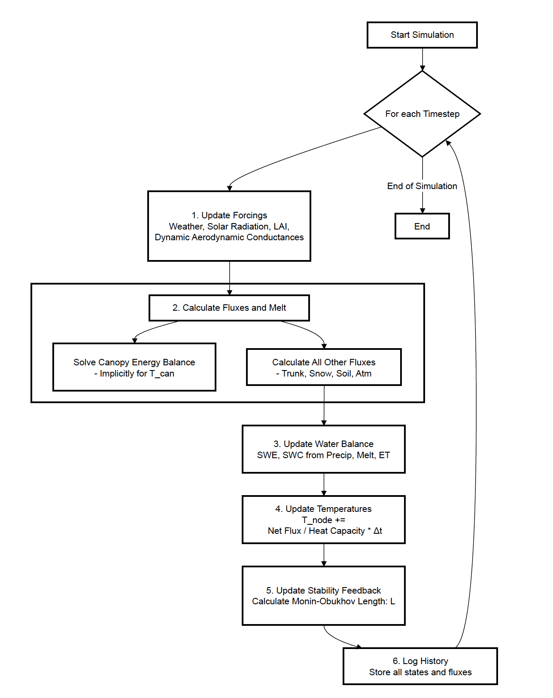

# Energy Balance Model Report

This document provides a detailed technical description of the single-point energy balance model. The model simulates the interactions between the land surface (forest ecosystem) and the atmosphere, resolving the energy and water budgets for different components of the ecosystem.

## 1. High-Level Model Overview

The model is a **process-based, one-dimensional land surface model** designed to simulate the microclimate within a forest stand (either deciduous or coniferous). It operates on a short time step (15 minutes) and resolves the temperatures of key ecosystem components (canopy, trunk, snow, and soil layers) and their water balance (snowpack on ground and canopy, and soil moisture).

Conceptually, the model can be understood as a **first-order RC (Resistor-Capacitor) network**. Each component (e.g., canopy, soil) acts as a thermal capacitor (`C`) that stores heat, and the pathways for energy exchange (e.g., convection, conduction) act as resistors (`R`). The model uses a **15-minute timestep** as a compromise to accurately capture the fast dynamics of the diurnal cycle without being computationally prohibitive. Due to its very low thermal mass (low capacitance) and rapid response to radiation, the **canopy temperature is solved for implicitly** at each step; this is essential for numerical stability and prevents unrealistic temperature oscillations. In contrast, the other, more massive components like the soil and trunk are solved for **explicitly**, which is computationally simpler and sufficient for their slower thermal response.

The simulation progresses through time, and at each step, it performs the following core operations:

1.  **Update Forcings & Parameters**: The model first calculates the environmental conditions for the current time step. This includes meteorological drivers like air temperature and solar radiation (based on harmonic functions), precipitation (based on a simple seasonal schedule), and phenological properties like the Leaf Area Index (LAI), which changes through the year for the deciduous forest type.
2.  **Calculate Energy & Water Fluxes**: This is the core of the model. It computes the exchange of energy (radiation, sensible heat, latent heat, conduction) and water (precipitation, interception, melt, runoff, evapotranspiration) between all the interacting components (nodes). A key feature is the **implicit solution of the canopy energy balance**, which ensures numerical stability by simultaneously solving for canopy temperature based on all its energy exchange pathways.
3.  **Update State Variables**: Based on the net fluxes calculated in the previous step, the model updates its state variables.
    *   **Temperatures**: The temperature of each component is updated based on its net energy gain or loss and its heat capacity.
    *   **Water Storage**: The amount of snow on the canopy and ground (`SWE_can`, `SWE`), and the soil water content (`SWC_mm`) are updated based on precipitation, melt, and evapotranspiration.
4.  **Update Stability**: The model calculates the atmospheric stability (represented by the Monin-Obukhov length, `L`) based on the total sensible heat flux from the surface. This stability value is then used in the *next* time step to adjust the aerodynamic conductances, creating a feedback loop between surface fluxes and atmospheric turbulence.
5.  **Log Data**: All state variables, forcings, and calculated fluxes are stored at each time step for later analysis and plotting.

This process is repeated for a specified number of years, including a "spin-up" period to allow the model to reach a stable equilibrium state.

### Simulation Flow Diagram

The following diagram illustrates the main loop of the simulation.

  
   
  <em>Simulation Flow Diagram</em>

## 2. Detailed Flux Calculations

The model consists of several interconnected nodes whose temperatures and water content are tracked. The fluxes between them determine the system's evolution.

### 2.1. Canopy Node

The canopy is the most dynamic component. Its temperature is determined implicitly by solving its energy balance equation using a Newton-Raphson numerical solver. This is crucial for stability, as the canopy has a low heat capacity and responds very quickly to changes in radiation.

The governing equation is:
\[ F(T_{can}) = R_{net,can} - H_{can} - LE_{can} - C_{can} - M_{can} - E_{int,rain} = 0 \]
where each term is a flux in W m⁻².

**1. Net Radiation (\(R_{net,can}\))**
This is the balance of incoming short-wave (solar) and long-wave (thermal) radiation against outgoing long-wave radiation.
\[ R_{net,can} = Q_{abs,can} + A_{can} \cdot \left( \epsilon_{can} (L_{\downarrow,atm} + L_{\uparrow,grnd}) - 2 \epsilon_{can} \sigma T_{can}^4 \right) \]

Here is a more detailed breakdown of the components:

-   **Absorbed Short-wave Radiation (\(Q_{abs,can}\))**: This is the amount of incoming solar radiation intercepted and absorbed by the canopy.
    \[ Q_{abs,can} = Q_{solar} \cdot A_{can,max} \cdot (1 - e^{-k_{ext} \cdot LAI}) \cdot (1 - \alpha_{can}) \]
    -   \(Q_{solar}\): The total incoming solar radiation at the top of the canopy (W m⁻²).
    -   \(A_{can,max}\): The maximum fractional area the canopy can cover (0.90). The term \(Q_{solar} \cdot A_{can,max}\) represents the radiation falling on the part of the grid cell that could contain the tree canopy.
    -   The term \((1 - e^{-k_{ext} \cdot LAI})\) comes from **Beer's Law**. It describes the fraction of light that is intercepted (extinguished) by the canopy as a function of its Leaf Area Index (\(LAI\)) and an extinction coefficient (\(k_{ext}\)).
    -   \((1 - \alpha_{can})\) is the absorptivity of the canopy, where \(\alpha_{can}\) is the canopy albedo (reflectivity). This term represents the fraction of intercepted light that is actually absorbed rather than reflected.
 

-   **Downwelling Long-wave Radiation (\(L_{\downarrow,atm}\))**: This is the thermal radiation emitted downwards by the atmosphere. It is calculated using the Stefan-Boltzmann law, with a dynamic emissivity.
    \[ L_{\downarrow,atm} = \epsilon_{atm} \cdot \sigma \cdot T_{atm}^4 \]
    -   \(\epsilon_{atm}\) is the effective emissivity of the atmosphere. It is calculated dynamically based on air temperature as a proxy for humidity (warmer air holds more water vapor, which is the primary source of atmospheric emissivity). The model uses a bounded hyperbolic tangent function to keep it within a realistic range (up to 0.9).
    -   \(\sigma\): Stefan-Boltzmann constant (5.67e-8 W m⁻² K⁻⁴).
    -   \(T_{atm}\): Air temperature (K).
 

-   **Upwelling Long-wave Radiation (\(L_{\uparrow,grnd}\))**: This is the thermal radiation emitted upwards from the ground surface. It is the area-weighted average of the emissions from the snow-covered and snow-free (soil) parts of the ground.
    \[ L_{\uparrow,grnd} = (A_{soil} \cdot \epsilon_{soil} \cdot \sigma \cdot T_{soil,surf}^4) + (A_{snow} \cdot \epsilon_{snow} \cdot \sigma \cdot T_{snow}^4) \]
    -   \(A_{soil}\) and \(A_{snow}\) are the fractional areas of exposed soil and snow, respectively.
    -   \(\epsilon_{soil}\) and \(\epsilon_{snow}\) are the emissivities of soil (0.95) and snow (0.98).
    -   \(T_{soil,surf}\) and \(T_{snow}\) are the temperatures of the surface soil and snow layers (K).
 

-   The final term, \(- 2 \epsilon_{can} \sigma T_{can}^4\), represents the thermal radiation emitted by the canopy itself, from both its top and bottom surfaces.

**2. Sensible Heat Flux (\(H_{can}\))**
This is the heat exchange with the air via convection.
\[ H_{can} = h_{can} \cdot (T_{can} - T_{air}) \]
-   **Aerodynamic Conductance (\(h_{can}\))**: This represents the efficiency of heat transfer between the canopy and the air. It is the inverse of aerodynamic resistance (\(r_a\)) and is dynamically adjusted for atmospheric stability. A minimum value for \(h_{can}\) of 10 W m⁻² K⁻¹ is enforced to prevent the canopy from becoming completely decoupled from the atmosphere, even at low LAI.
    \[ h_{can} = \frac{\rho_{air} \cdot c_{p,air}}{r_a} \]
    \[ r_a = \frac{[\ln(z_{ref}/z_0) - \Psi_h(\zeta)]^2}{\kappa^2 \cdot u} \]
    -   \(\rho_{air}\) and \(c_{p,air}\) are the density and specific heat capacity of air. 
    -   \(r_a\) is the aerodynamic resistance to heat transfer (s m⁻¹). 
    -   \(z_{ref}\) is the reference height where air temperature is measured (15 m), and \(z_0\) is the canopy roughness length (1.5 m). 
    -   \(\kappa\) is the von Kármán constant (0.41), and \(u\) is the wind speed (fixed at 2.0 m s⁻¹ in this model for simplicity). 
    -   \(\Psi_h\) is the **Monin-Obukhov stability correction function** for heat. It adjusts the resistance based on whether the atmosphere is stable (resists vertical motion) or unstable (promotes it). It is a function of \(\zeta = z_{ref}/L\), where \(L\) is the Monin-Obukhov length, a measure of atmospheric stability. This feedback is critical for realistically modeling surface-atmosphere interactions.
 
-   \(T_{air}\): Temperature of the near-surface atmosphere model layer (K).

**3. Latent Heat Flux (Transpiration, \(LE_{can}\))**
This is the energy consumed by water evaporating from leaf stomata (transpiration). The model uses the **Priestley-Taylor formulation**, which estimates potential evapotranspiration based on available energy.
\[ LE_{can} = \alpha_{PT} \cdot f_{stress} \cdot \frac{\Delta}{\Delta + \gamma} \cdot R_{net,can} \]
-   \(\alpha_{PT}\): Priestley-Taylor coefficient (1.26), an empirically derived value. 
-   **Slope of the Saturation Vapor Pressure Curve (\(\Delta\))**: This term describes how much the saturation vapor pressure changes with temperature. It is the derivative of the saturation vapor pressure function (\(e_{sat}\)) with respect to temperature. The model uses an approximation derived from the Tetens equation.
    \[ \Delta = \frac{de_{sat}}{dT} = \frac{4098 \cdot e_{sat}(T)}{((T - 273.15) + 237.3)^2} \]
    \[ e_{sat}(T) = 0.6108 \cdot \exp\left(\frac{17.27 \cdot (T - 273.15)}{(T - 273.15) + 237.3}\right) \]
    -   \(T\) is the temperature in Kelvin. 
    -   \(e_{sat}\) is the saturation vapor pressure in kPa. This formulation is an accurate empirical fit to the Clausius-Clapeyron equation.
 
-   \(\gamma\): Psychrometric constant (~0.066 kPa K⁻¹). 
-   \(R_{net,can}\): The net radiation provides the energy for evaporation. 
-   \(f_{stress}\): A stress factor (\(0 \to 1\)) that reduces transpiration under dry conditions. It is the product of soil moisture stress (reduces when `SWC` is low) and vapor pressure deficit (VPD) stress (reduces when air is very dry).

**4. Conduction to Trunk (\(C_{can}\))**
Heat conducted between the canopy biomass and the tree trunk.
\[ C_{can} = \frac{k_{ct} \cdot A_{c2t}}{d_{ct}} \cdot (T_{can} - T_{trunk}) \] 
-   \(k_{ct}\): Thermal conductivity between canopy and trunk. 
-   \(A_{c2t}\), \(d_{ct}\): Effective contact area and distance for conduction.

**5. Canopy Snow Melt (\(M_{can}\))**
The model uses a two-stage process to handle the melting of snow intercepted by the canopy. This is a critical feature because the canopy's temperature can rise above freezing while snow is still present.

First, the model calculates the net energy balance of the canopy as if its temperature were exactly at the freezing point (0°C or 273.15 K).
\[ F_{@0^\circ C} = R_{net,can} - H_{can} - LE_{can} - C_{can} - E_{int,rain} \quad (\text{all terms evaluated at } T_{can}=0^\circ C) \]
If this hypothetical balance \(F_{@0^\circ C}\) is positive, it represents surplus energy available for melt. The model then determines if this energy is sufficient to melt all the snow on the canopy in one timestep.  
-   **Partial Melt**: If the available energy is less than the energy required to melt all the snow, the canopy temperature is **clamped at 0°C**. All the surplus energy is directed into the melt flux (\(M_{can} = F_{@0^\circ C}\)), and some snow remains.  
-   **Full Melt**: If the available energy is greater than or equal to what's needed to melt all the snow, the melt flux is set to exactly the energy required to remove the remaining snow. This melt becomes a fixed energy sink, and the model proceeds to solve for a final canopy temperature that will be above 0°C. 

This meltwater then drips to the ground and is added to the ground's water balance.

**6. Intercepted Rain Evaporation (\(E_{int,rain}\))**
The model assumes that a fraction of incoming rain is intercepted by the canopy and evaporates within the same timestep. This acts as an immediate energy sink.
\[ E_{int,rain} = \frac{P_{intercepted} \cdot L_v \cdot \rho_{water}}{\Delta t} \]
-   \(P_{intercepted}\): Depth of intercepted rain (m). 
-   \(L_v\): Latent heat of vaporization (2.5e6 J kg⁻¹). 
-   \(\rho_{water}\): Density of water (1000 kg m⁻³). 
-   \(\Delta t\): Timestep in seconds.

### 2.2. Ground Nodes (Snow and Soil)

The ground is composed of a snow layer (if present) and a soil layer. Energy fluxes are calculated for the surface exposed to the atmosphere.

The energy balance for the **snowpack** is:
\[ \frac{dT_{snow}}{dt} \cdot C_{snow} = LW_{net,snow} + SW_{in,snow} - H_{snow} + C_{soil \to snow} + C_{trunk \to snow} - M_{snow} \]
-   The change in snow temperature is driven by net long-wave and absorbed short-wave radiation, sensible heat exchange with the air (\(H_{snow}\)), conduction from the soil and trunk, and the energy consumed by melt (\(M_{snow}\)).

The energy balance for the **surface soil layer** is:
\[ \frac{dT_{soil,surf}}{dt} \cdot C_{soil,surf} = LW_{net,soil} + SW_{in,soil} - H_{soil} - LE_{soil} + C_{trunk \to soil} - C_{soil \to snow} - C_{surf \to deep} \]
-   The surface soil temperature changes based on radiation, sensible heat (\(H_{soil}\)), latent heat of evaporation (\(LE_{soil}\)), and conduction to/from the trunk, snow, and the deep soil layer.

The energy balance for the **deep soil layer** is simpler, involving only conduction:
\[ \frac{dT_{soil,deep}}{dt} \cdot C_{soil,deep} = C_{surf \to deep} - C_{deep \to boundary} \]

A detailed breakdown of the key ground flux terms is below.

**1. Radiation Balance**
-   **Short-wave Radiation (\(SW_{in}\))**: This is the solar radiation absorbed by the ground surface. It depends on the radiation that makes it through the canopy and the albedo (reflectivity) of the ground components (soil and snow).
    \[ Q_{ground} = \overbrace{Q_{solar} \cdot (1 - A_{can,max})}^{\text{Gap Radiation}} + \overbrace{Q_{solar} \cdot A_{can,max} \cdot e^{-k_{ext} \cdot LAI}}^{\text{Transmitted Radiation}} \]
    - The total radiation reaching the ground (\(Q_{ground}\)) is the sum of what passes directly through gaps in the maximum canopy area and what is transmitted through the canopy itself according to Beer's Law. 
    - This available radiation is then partitioned and absorbed by the snow and soil surfaces based on their fractional area (\(A_{snow}\), \(A_{soil}\)) and albedo (\(\alpha\)). 
    \[ SW_{in, soil} = Q_{ground} \cdot A_{soil} \cdot (1 - \alpha_{soil}) \]
    \[ SW_{in, snow} = Q_{ground} \cdot A_{snow} \cdot (1 - \alpha_{snow}) \]
    - The model uses a high albedo for snow (\(\alpha_{snow}=0.8\)) and a lower one for soil (\(\alpha_{soil}=0.2\)).
 
-   **Long-wave Radiation (\(LW_{net}\))**: This is the net balance between incoming and outgoing thermal radiation at the ground surface.
    \[ LW_{in} = (1 - A_{can}) \cdot L_{\downarrow,atm} + A_{can} \cdot (\epsilon_{can}\sigma T_{can}^4 + (1-\epsilon_{can})L_{\downarrow,atm}) \]
    - The ground receives long-wave radiation (\(LW_{in}\)) from two sources: directly from the atmosphere through canopy gaps (the `(1 - A_can)` term) and from the base of the canopy (the `A_can` term). The canopy emission itself is supplemented by atmospheric radiation that passes through the canopy foliage without being absorbed. 
    - The net flux for each surface is the difference between what it absorbs and what it emits, scaled by its emissivity (\(\epsilon\)) and fractional area. 
    \[ LW_{net, soil} = A_{soil} \cdot \epsilon_{soil} \cdot (LW_{in} - \sigma T_{soil,surf}^4) \]
    \[ LW_{net, snow} = A_{snow} \cdot \epsilon_{snow} \cdot (LW_{in} - \sigma T_{snow}^4) \]

**2. Sensible Heat Flux (\(H_{soil}\), \(H_{snow}\))**
Similar to the canopy, the ground exchanges sensible heat with the overlying air. Separate conductances (\(h_{soil}\), \(h_{snow}\)) are calculated for the soil and snow surfaces.

**3. Soil Evaporation (\(LE_{soil}\))**
The snow-free soil fraction can evaporate water, calculated using a Priestley-Taylor approach similar to the canopy, but driven by the net radiation at the soil surface.

**4. Ground Snow Melt (\(M_{grnd}\))**
The calculation for ground snow melt is more direct than for the canopy. At each timestep, the model checks for three conditions:
1.  There is snow on the ground (\(SWE > 0\)). 
2.  The snowpack temperature has reached the freezing point (\(T_{snow} \geq 0^\circ C\)). 
3.  The net energy flux into the snowpack is positive. 

If all three conditions are met, the entire net positive flux is treated as energy available for melt. The snow temperature itself is held at 0°C, and the surplus energy is used to convert snow to liquid water.
\[ M_{grnd} = \text{max}(0, \sum F_{snow}) = \text{max}(0, LW_{net,snow} + SW_{in,snow} - H_{snow} + C_{soil \to snow} + C_{trunk \to snow}) \]
This meltwater then either infiltrates the soil or contributes to runoff if the soil is saturated.

**5. Conduction**
-   **Soil-Snow Conduction (\(C_{soil \leftrightarrow snow}\))**: If snow is present, heat is conducted between the bottom of the snowpack and the top of the soil. This is modeled using a thermal resistance analogy.
    \[ C_{soil \leftrightarrow snow} = \frac{A_{snow} \cdot (T_{soil,surf} - T_{snow})}{R_{soil} + R_{snow}} \]
    -   The thermal resistance of the soil (\(R_{soil}\)) and snow (\(R_{snow}\)) depends on their thickness and thermal conductivity. 
    \[ R_{soil} = \frac{0.5 \cdot d_{soil,surf}}{k_{soil}} \quad , \quad R_{snow} = \frac{0.5 \cdot \text{snow_depth}}{k_{snow\_pack}} \]
    - This flux is critical for melting the snowpack from below.
 
-   **Soil Layer Conduction (\(C_{surf \leftrightarrow deep}\))**: Heat is conducted between the center of the surface soil layer (0.3 m thick) and the center of the deep soil layer (1.7 m thick) based on Fourier's Law. A similar calculation governs heat flow between the deep layer and a fixed-temperature boundary below.
    \[ C_{surf \leftrightarrow deep} = \frac{k_{soil} \cdot (T_{soil,surf} - T_{soil,deep})}{0.5 \cdot (d_{soil,surf} + d_{soil,deep})} \]
    -   \(k_{soil}\) is the soil thermal conductivity (1.2 W m⁻¹ K⁻¹). This process governs the slow warming and cooling of the deep soil profile.

### 2.3. Trunk Node

The trunk is a simple thermal reservoir that connects the canopy and the ground. Its energy balance is:
\[ \frac{dT_{trunk}}{dt} \cdot C_{trunk} = C_{canopy \to trunk} - C_{trunk \to ground} - H_{trunk} \]
-   The trunk's temperature changes due to conduction from the warmer canopy, and heat loss via conduction to the cooler ground (snow or soil) and sensible heat exchange with the air.

 
-   **Sensible Heat (\(H_{trunk}\))**: Exchanges heat with the atmosphere via a constant conductance term. 
-   **Conduction (\(C_{trunk}\))**: Conducts heat to/from the canopy (as described above) and to/from the ground (either the snowpack or the surface soil, depending on snow cover).

### 2.4. Atmospheric Model Layer

This is a simple "box model" representing the near-surface air. Its temperature is influenced by the energy fluxes from all the underlying surface components. The governing equation is:
\[ \frac{dT_{air}}{dt} \cdot C_{atm} = H_{can \to atm} + H_{trunk \to atm} + H_{soil \to atm} + H_{snow \to atm} + Relax_{atm} \]
-   The air temperature changes due to the sum of sensible heat fluxes from all the surface components and a relaxation term. This relaxation term, which pulls the air temperature towards a large-scale background temperature, is a simplification that implicitly accounts for the net effects of advection and the full atmospheric radiation balance, which are not explicitly modeled.
 
-   **Sensible Heat**: It *receives* the sensible heat fluxes from the canopy, trunk, soil, and snow. 
-   **Advective Relaxation**: The model air temperature is "relaxed" back towards a large-scale ambient temperature (\(T_{large\_scale}\)) over a characteristic timescale (\(\tau_{adv}\) = 1 hour). This represents the process of advection (wind) mixing the local air with the broader atmosphere, preventing the model's air temperature from drifting unrealistically.
\[ Relax_{atm} = \frac{C_{atm}}{\tau_{adv}} (T_{large\_scale} - T_{air}) \]

## 3. Key Model Parameters & Rationale

The parameters listed below are realistic starting points, but it is important to recognize that they are not fixed. For a specific application, particularly for a boreal forest ecosystem near 60°N, these values should be seen as means within a broader distribution of possible values derived from both literature and direct field measurements. This framework is therefore well-suited for more advanced analyses, such as **Monte Carlo simulations**, where parameters are varied across their uncertainty ranges to quantify the model's sensitivity and output uncertainty.

Furthermore, the model can be used to simulate a **tree-free environment** (e.g., grassland or tundra) simply by setting the maximum canopy area, `A_can_max`, to zero. This effectively removes the canopy and trunk nodes from the simulation, allowing for direct comparison of energy and water budgets with and without forest cover.

Below is a more extensive, though not exhaustive, list of key parameters:

-   **Heat Capacities (J m⁻² K⁻¹)**: These values determine the thermal inertia of each component.
    -   `C_CANOPY_LEAF_OFF`: 2.0e4 (Represents bare woody biomass) 
    -   `C_CANOPY_LEAF_ON`: 8.0e4 (Includes the thermal mass of water in foliage) 
    -   `C_TRUNK`: 5.0e5 (A large woody reservoir) 
    -   `C_SOIL_TOTAL`: 6.0e6 (The largest thermal mass, reflecting its slow response time)
 

-   **Aerodynamic Parameters**: These govern the efficiency of turbulent exchange with the atmosphere.
    -   `z_ref_h`: 15.0 m (Standard reference height for atmospheric variables) 
    -   `z0_can`: 1.5 m (Canopy roughness length, typical for a forest) 
    -   `z0_soil`: 0.01 m (Soil roughness length, typical for a bare or sparsely vegetated surface) 
    -   `CANOPY_MIN_H`: 10.0 W m⁻² K⁻¹ (A minimum conductance to prevent the canopy from becoming unrealistically isolated from the atmosphere, especially in winter)
 

-   **Radiation Parameters**: These control how solar and thermal radiation are absorbed, reflected, and emitted.
    -   `eps_can`, `eps_soil`, `eps_snow`: 0.98, 0.95, 0.98 (Emissivity values, typical for natural surfaces) 
    -   `alpha_snow`: 0.8 (High reflectivity of fresh snow) 
    -   `alpha_soil`: 0.2 (Lower reflectivity of dark soil) 
    -   `alpha_can_base`: 0.18 (deciduous) / 0.08 (coniferous) (Base canopy albedo) 
    -   `k_ext_factor`: 0.6 (Beer's Law extinction coefficient, controlling light attenuation through the canopy)
 

-   **Phenology & Forest Structure**: These define the seasonal canopy development and physical structure.
    -   `growth_day`: 140 (Day of year for start of leaf growth) 
    -   `fall_day`: 270 (Day of year for start of leaf senescence) 
    -   `LAI_max`: 5.0 (deciduous) / 4.0 (coniferous) (Peak one-sided leaf area index) 
    -   `A_can_max`: 0.90 (The maximum fraction of the grid cell that the forest canopy can cover)
 

-   **Soil & Water Parameters**:
    -   `k_soil`: 1.2 W m⁻¹ K⁻¹ (A typical soil thermal conductivity) 
    -   `SWC_max_mm`: 150.0 mm (Maximum water holding capacity of the soil column) 
    -   `soil_stress_threshold`: 0.4 (Transpiration begins to be limited when soil water drops below 40% of maximum) 
    -   `PT_ALPHA`: 1.26 (Priestley-Taylor coefficient for estimating potential evapotranspiration)
 

-   **Implicit vs. Explicit Solvers**: The choice of numerical solver is a key parameter of the model design.
    -   **Implicit (Canopy)**: As mentioned, the canopy has low thermal mass and responds almost instantly to radiation. An explicit solver would lead to massive, unstable temperature oscillations. The implicit method solves for a temperature that is consistent with the fluxes at the *current* timestep, ensuring stability. 
    -   **Explicit (Other Nodes)**: For components with high thermal mass like the soil and trunk, temperature changes slowly. A simpler and computationally faster explicit method is sufficient and stable for these nodes.

## 4. Model Analogy: First-Order RC Network

-   **The 'First-Order' System**: The governing equation for each node's temperature is a first-order ordinary differential equation, as it relates the rate of change of temperature (\(dT/dt\)) to the current state of the system:
    \[ \frac{dT_{node}}{dt} = \frac{\sum \text{Fluxes}}{C_{node}} \]

### Key Non-Linearities

While the RC analogy is a useful conceptual framework, this model is significantly more complex than a simple linear circuit due to several key **non-linearities**:

1.  **Radiation**: The long-wave radiation flux is proportional to the fourth power of temperature (\(T^4\)), not a linear temperature difference. This means the radiative "resistance" is itself a strong function of temperature.
2.  **Latent Heat**: The calculation for evapotranspiration is highly non-linear, as it depends on the slope of the saturation vapor pressure curve (\(\Delta\)), which is an exponential function of temperature.
3.  **Dynamic Feedbacks**: The aerodynamic resistances are not constant. They are dynamically adjusted at each time step based on atmospheric stability (the Monin-Obukhov length, \(L\)). Since stability depends on the sensible heat flux, which in turn depends on the resistance, this creates a complex feedback loop.

In summary, thinking of the model as a non-linear, first-order RC network is an accurate way to understand its fundamental structure.
